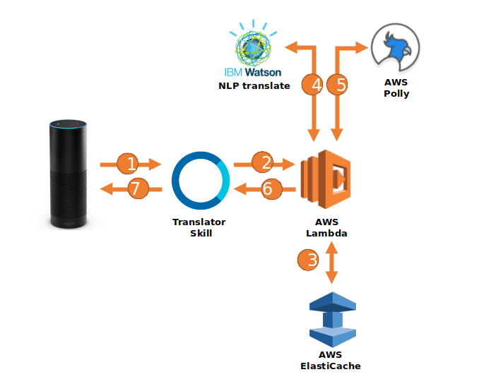

## Alexa transtion skill using Machine Learning services

This [Alexa Skills Kit](https://developer.amazon.com/alexa-skills-kit) microservice combines the [AWS Polly](https://aws.amazon.com/polly/) and [IBM Watson](https://www.ibm.com/watson/developercloud/natural-language-understanding.html) to translate phrases into foreign languages. 

## Youtube Demo

[Youtube Demo](https://youtu.be/AtzRwTrjsgw)

## Challenge and Approach

Our approach for satisfying the Machine Learning challenge was to:

1. Utilize Amazon Alexa's IoT skills to develop a natural language processing (NLP) API
2. Utilize IBM Watson to improve translation services using Deep Learning for unknown languages
3. Increase scability and availability by utilization of Redis as a caching mechanism
4. Render natural voice text-to-speech reponses with Amazon Polly

## Our team is comprised of:

- [@loudest](https://github.com/loudest) - Spent 2016 traveling to 12 countries.

## Microservices architecture

## Technologies, APIs, and Datasets Utilized

I made use of:
- [Flask](http://flask.pocoo.org/) python RESTful microservice
- [Alexa Skills Kit](http://opencv.org/) for interaction with Alexa IoT device
- [AWS Polly](https://aws.amazon.com/polly/) to generate dynamic natural voice text-to-speech MP3 files
- [IBM Watson](https://www.ibm.com/watson/developercloud/natural-language-understanding.html) for language identification and translation services
- [AWS Lambda](http://github.com/mrdoob/stats.js) NoOps cloud hosting with horizontal auto-scaling and load-balancing capabilities
- [AWS ElastiCache / Redis](https://aws.amazon.com/elasticache/) in-memory noSQL data store to enable low latency look-ups of datasets

## Microservice REST API explained
Flask service listens to the following REST endpoints:
1. /voices - return AWS Polly natural voice text-to-speech synthesis choices
2. /read/<voiceId>/<outputFormat> - returns English MP3 text of <voiceId> obtained from /voices in <outputFormat>[mp3,ogg,pcm].  text=<string> as GET input variable
3. /translate/<language> - returns translated <language> MP3 text of from text=<string> as GET input variable
4. /alexa - Alexa Skill service.  Utilizes the following utterance: what is {text} in {language}.

## License 
The code is licensed under the [MIT License](LICENSE.md). Pull requests will be accepted to this repo, pending review and approval.
